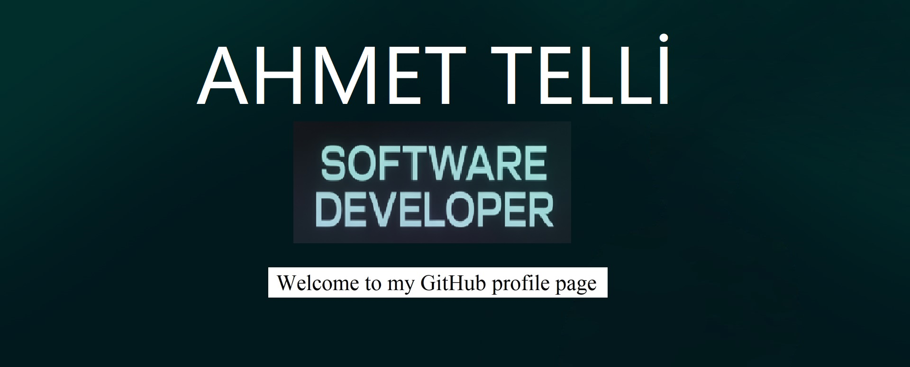

<!-- HEADER -->

  

---

<h1 align="left">
  
   About Me
</h1>

I am a passionate .NET Developer building scalable web applications and API solutions. Focused on writing clean, maintainable, and efficient code.
I am currently experimenting with microservices architecture and Azure.
Looking for opportunities to contribute and grow. Feel free to connect!

---

<h1 align="left">
  
   Connect
</h1>

---

# 💻 Tech Stack

## Backend

## Frontend

## Database

## DevOps & Cloud

---
# GitHub Analytics

  

  
  

---

# 📈 Activity Overview

  

---

# ⏱ Productivity Insights

  

